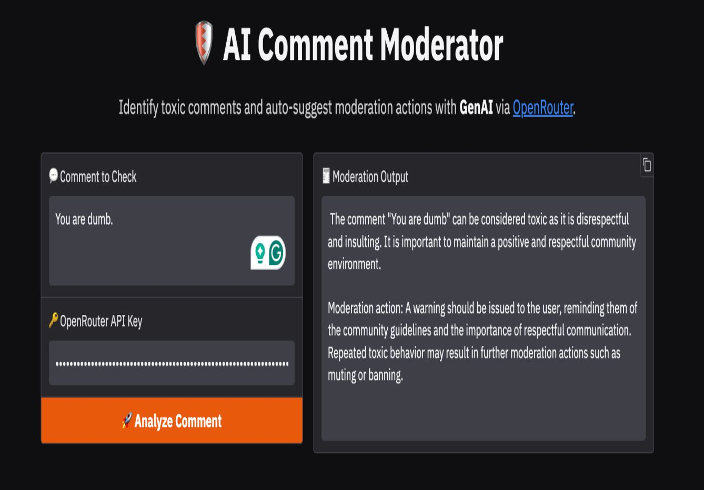
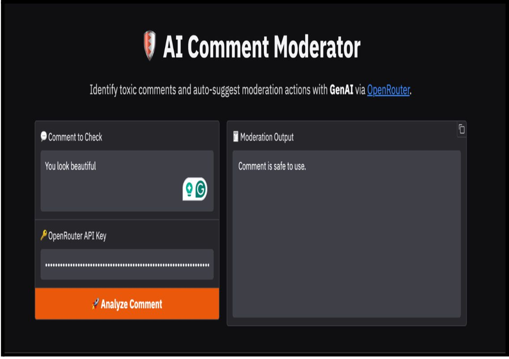
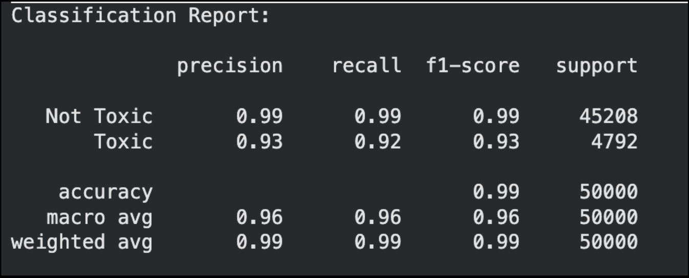
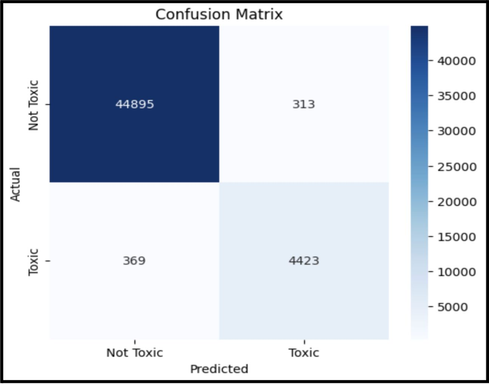
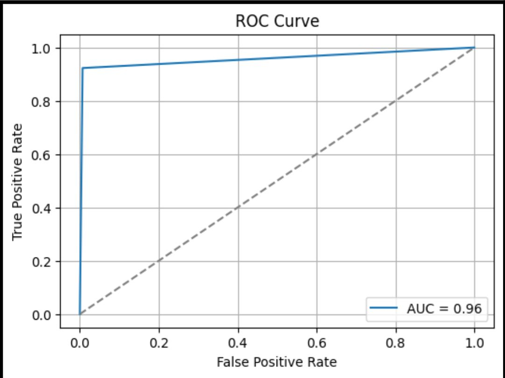
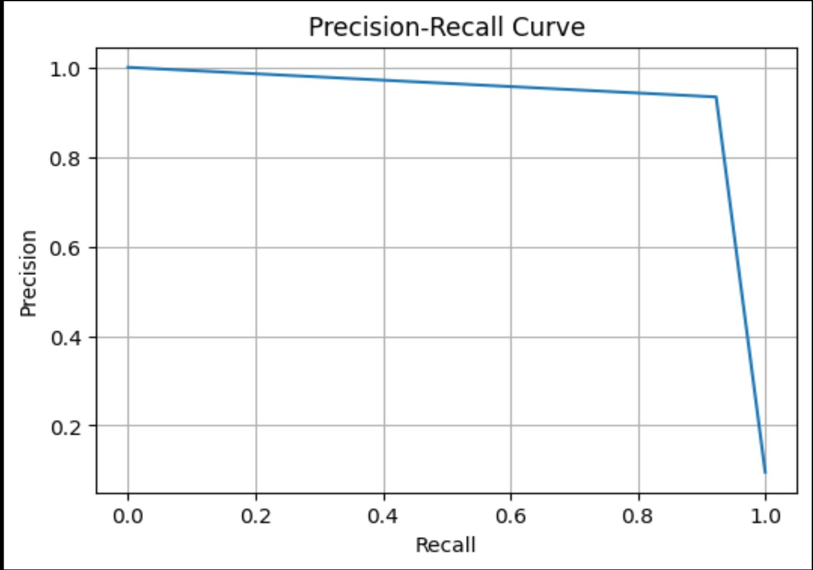

# AI-Powered Toxic Comment Detection & Moderation System

A production-style NLP moderation pipeline that detects toxic user comments using a fine-tuned Transformer model and supports automated moderation workflows (classification, evaluation, and decision support). This repository includes the dataset, trained model artifacts (via Git LFS), and a complete reproducible notebook pipeline.

---

## Why This Project
Online platforms require scalable systems to detect harmful content while maintaining transparency and consistency in moderation decisions. This project demonstrates an end-to-end solution combining:

- Transformer-based toxicity classification  
- Multi-label moderation categories  
- Evaluation using industry-standard metrics  
- A lightweight moderation UI output workflow  

---

## Core Capabilities
- Fine-tuned Transformer toxicity classifier (DistilBERT-style)
- Multi-label classification across:
  - toxic  
  - severe_toxic  
  - obscene  
  - threat  
  - insult  
  - identity_hate  
- End-to-end reproducible pipeline (training → evaluation → inference)
- Evaluation artifacts: classification report, confusion matrix, ROC curve, precision-recall curve
- Model + tokenizer artifacts included
- Large model weights tracked using Git LFS for full reproducibility

---

## Tech Stack
Python • PyTorch • HuggingFace Transformers • Scikit-learn • Pandas/NumPy • Matplotlib/Seaborn • Git LFS

---

## Demo (UI Outputs)

### Toxic Comment Example


### Safe Comment Example


---

## Model Evaluation Artifacts

### Classification Report


### Confusion Matrix


### ROC Curve


### Precision-Recall Curve


---

## Repository Contents
- `ML_Final_Project_code_notebook.ipynb` — complete training, evaluation, and inference workflow  
- `train.csv`, `test.csv`, `test_labels.csv` — dataset splits  
- `toxicity_model/` — trained model weights + tokenizer artifacts  
- `requirements.txt` — dependencies  
- `RUN.md` — quick run instructions  
- `MODEL_CARD.md` — model documentation and limitations  
- `ML Final Project report.pdf` — full methodology + results  
- `ML Final Project PPT.pptx` — summary slides  

---

## Getting Started

### 1) Clone the Repository
```bash
git clone <YOUR_REPO_URL>
cd <YOUR_REPO_FOLDER>

2) Install Dependencies
pip install -r requirements.txt

3) Run the Notebook

Open and run:
	•	ML_Final_Project_code_notebook.ipynb


Model Artifacts (Git LFS)

The trained weights are stored here:
	•	toxicity_model/model.safetensors

This file is tracked using Git LFS due to GitHub’s file size limits.

⸻

Security Notes

If your notebook uses API keys for any optional LLM-based extensions:
	•	Store them locally in a .env file
	•	Never commit .env to GitHub
	•	Use .env.example as the safe template

⸻

Author

Nayanpreet Chhabra
Binghamton University